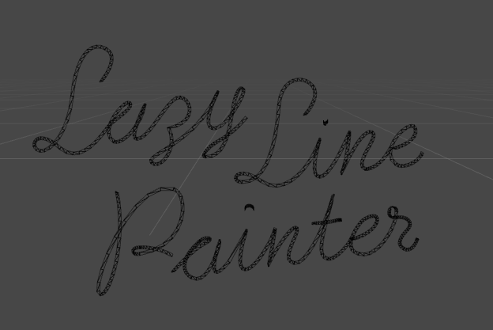
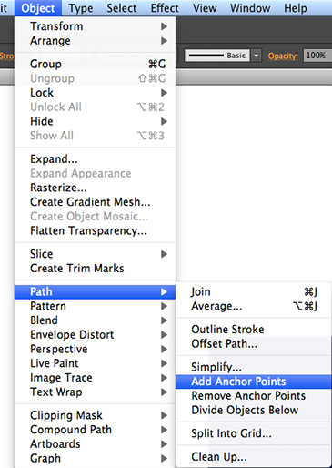
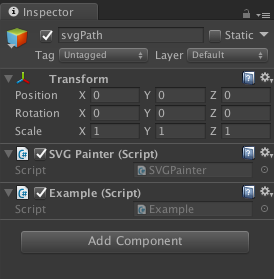

SVG Line Painter for Unity
=================


It works like a js version of SVG line animation like "LazyLinePainter" which you can find js library link in below.
https://github.com/camoconnell/lazy-line-painter

Also SVG part of code is a port of https://github.com/colinmeinke/svg-points/blob/master/src/toPoints.js


**Preparing your SVG data** <br>
Create your Line art in your vector editor of choice
- Ensure there are no fills.
- No closed paths. i.e - Line needs a start and end.
- Crop Artboard nice & tight!
- If you draw simple circle, you need to add anchor point. Othewise library will not draw circle.
Export as .SVG (Default export options are fine)<br>
Convert SVG file to text file. e.g - You can rename like "test.svg.txt".<br>



## SetUp
Copy `Assets/SVGPainterUnity` directory to your Assets directory.<br>
Add a `SVGPainter` component to a GameObject.<br>
Add your SVG text file to `Resources/` directory.



## Example


Here is how to animate.

```C#
var svgPainter = GetComponent<SVGPainter> ();
svgPainter.Init ("test.svg");
svgPainter.Play (3f, PainterEasing.EaseInOutCubic);
```

## Compatibility
SVGLinePainter is only tested on MacOS with OpenGLCore and not sure about another platform.

## License
MIT
